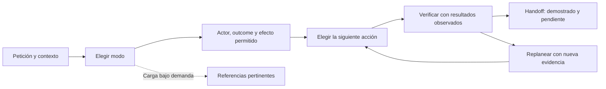

# FDE Live Case Skill

Una skill de Codex para preparar y resolver casos de **Forward Deployed Engineering**: diagnosticar un fallo, entregar una capacidad operativa o aclarar un problema de cliente antes de construir.

Su objetivo es obtener el **menor resultado verificable que avance el problema**, manteniendo separados los hechos, las hipótesis, los permisos y lo que todavía no se ha demostrado. Incluye preparación, simulaciones, apoyo durante un caso y evaluación posterior. No es una metodología oficial de ninguna empresa.

**Configuración probada:** GPT-6.1 Sol con esfuerzo `medium`. La skill no selecciona el modelo ni cambia el esfuerzo de la sesión.

## Cómo funciona



La ruta depende de la incertidumbre dominante, no de completar un acrónimo:

| Situación | Primer movimiento útil | Evidencia de cierre |
|---|---|---|
| Fallo conocido | Reproducir o inspeccionar trazas y contrastar hipótesis | Corrección respaldada y regresión ejecutada |
| Capacidad relativamente clara | Definir usuario → decisión → información → acción | Slice verificable y fallo prioritario cubierto |
| Problema ambiguo | Localizar la decisión pendiente y el probe que puede cambiarla | Recomendación respaldada, incluso no construir |

## Instalar

Clona este repositorio y copia **solo** `fde-live-case-skill/` a tu directorio de skills personales. Si ya existe una versión, conserva una copia antes de reemplazarla. No copies el repositorio completo como una skill.

PowerShell, primera instalación:

```powershell
git clone https://github.com/KimiK1983/fde-live-case-skill.git
New-Item -ItemType Directory -Force -Path "$env:USERPROFILE\.codex\skills" | Out-Null
Copy-Item -Recurse -LiteralPath .\fde-live-case-skill\fde-live-case-skill -Destination "$env:USERPROFILE\.codex\skills"
```

macOS/Linux, primera instalación:

```bash
git clone https://github.com/KimiK1983/fde-live-case-skill.git
mkdir -p ~/.codex/skills
cp -R ./fde-live-case-skill/fde-live-case-skill ~/.codex/skills/
```

Abre una sesión nueva de Codex y comprueba que aparece `fde-live-case-skill`. Selecciona GPT-6.1 Sol y `medium` en la sesión. Las referencias son Markdown; no necesitas un servidor, una API key ni Docker para usar la skill. Python solo es necesario para los scripts auxiliares.

## Empezar

```text
$fde-live-case-skill
Tengo dos horas para preparar un caso FDE. Ayúdame a elegir ejercicios
y a recoger evidencia de aprendizaje. No reveles las soluciones antes del intento.
```

Para trabajar en un problema real o un ejercicio fuera de una entrevista:

```text
$fde-live-case-skill
Fuera de una entrevista, resuelve este bug autónomamente en este repositorio.
Esperado: [...]. Observado: [...]. Se permite editar y ejecutar pruebas locales.
No se permiten escrituras en sistemas externos. Reproduce primero y verifica la corrección.
```

Para un mock, separa candidato y facilitador. No entregues al candidato el paquete completo: contiene oracles. La [guía de uso](docs/GUIA_DE_USO.md#simulación-y-evaluación) explica la exportación y el aislamiento necesario.

## Qué evidencia hay

| Comprobación | Resultado | Qué permite afirmar |
|---|---|---|
| Tests del paquete | **46/46 correctos** | Integridad estructural y regresiones de scripts |
| GPT-6.1 Sol `medium`: cuatro regresiones conocidas | **4/4 logradas** | Funcionamiento observado en cálculo, conservación de campos, escritura incierta y selección de modo |
| Superioridad frente a otra versión | **No verificada** | No se ejecutó una comparación ciega A/B con el nuevo modelo |

El modelo ejecutó el cálculo correcto de **2.060 minutos**, reprodujo la pérdida de un filtro de país y comprobó una corrección local, mantuvo `unknown` tras una escritura incierta y no activó un oracle desde un ejemplo citado. No son cuatro casos completos de cliente ni una tasa de éxito generalizable.

Consulta [la evidencia, los criterios y las limitaciones](docs/EVIDENCIA.md). Incluye respuestas, comandos y resultados revisables; también deja constancia de una prueba anterior que detectó un fallo de interpretación. Los tests verdes no demuestran eficacia en entrevistas ni resultados de negocio.

## Documentación

- [Guía completa: instalación, modos, ejemplos, mocks y troubleshooting](docs/GUIA_DE_USO.md)
- [Evidencia y reproducción de las regresiones](docs/EVIDENCIA.md)
- [Skill raíz y tarjeta para 45–90 minutos](fde-live-case-skill/SKILL.md)
- [Cómo comparar versiones y medir aprendizaje](fde-live-case-skill/references/MEASUREMENT.md)
- [Práctica técnica: seis packs y sus oracles](fde-live-case-skill/references/PRACTICE.md)
- [Cuatro casos de campo: discovery, integración, journey e incidentes](fde-live-case-skill/references/FIELD_PRACTICE.md)

**Advertencia para evaluación:** los ejercicios y respuestas de este repositorio son públicos. Sirven para aprender y comprobar regresiones; un holdout ciego necesita casos nuevos y oracles privados inaccesibles al candidato.
