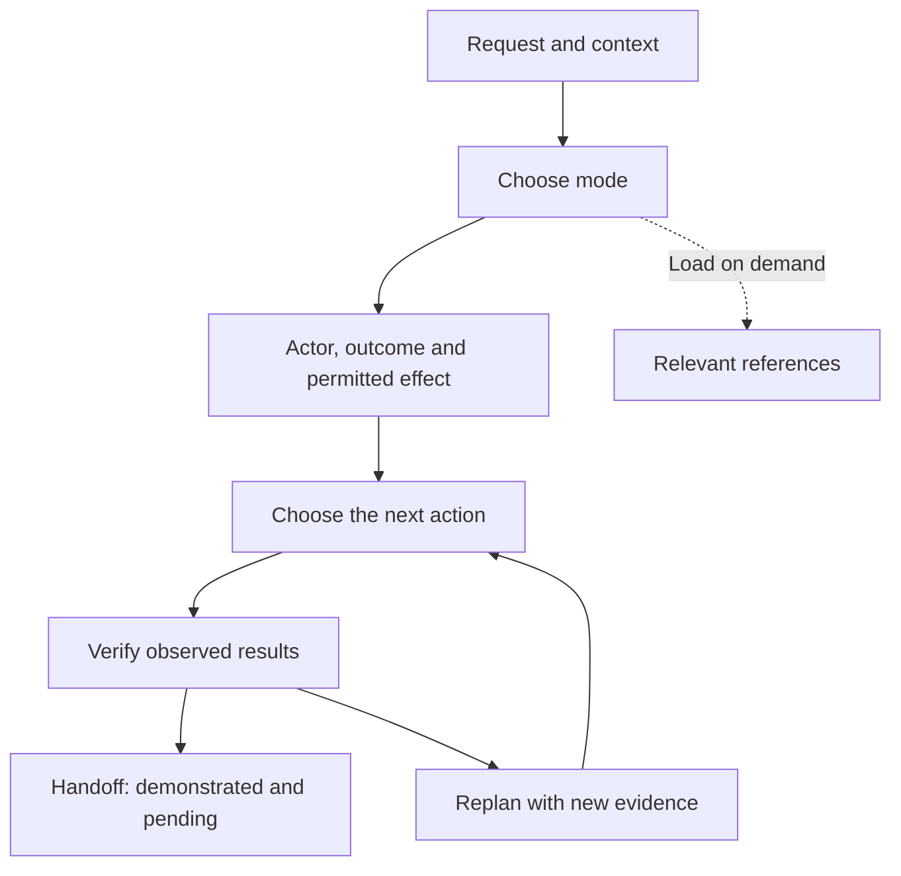

# FDE Live Case Skill

A Codex skill for preparing and solving **Forward Deployed Engineering** cases: diagnose a failure, deliver an operational capability, or clarify a customer problem before building.

Its goal is the **smallest verifiable result that advances the problem**, keeping facts, hypotheses, permissions, and unproven claims separate. It supports preparation, simulations, live-case assistance, and post-attempt assessment. It is not any company's official methodology.

**Tested configuration:** GPT-6.1 Sol with `medium` reasoning effort. The skill does not select the model or change session effort.

## How it works



Choose the route by dominant uncertainty, not by completing an acronym:

| Situation | First useful move | Closing evidence |
|---|---|---|
| Known failure | Reproduce or inspect traces and contrast hypotheses | Supported correction and executed regression |
| Relatively clear capability | Define user → decision → information → action | Verifiable slice covering the priority failure |
| Ambiguous problem | Identify the pending decision and a probe that could change it | Supported recommendation, including not building |

## Install

Clone this repository and copy **only** `fde-live-case-skill/` into your personal skills directory. If a version already exists, back it up before replacing it. Do not install the entire repository as a skill.

PowerShell, first installation:

```powershell
git clone https://github.com/KimiK1983/fde-live-case-skill.git
New-Item -ItemType Directory -Force -Path "$env:USERPROFILE\.codex\skills" | Out-Null
Copy-Item -Recurse -LiteralPath .\fde-live-case-skill\fde-live-case-skill -Destination "$env:USERPROFILE\.codex\skills"
```

macOS/Linux, first installation:

```bash
git clone https://github.com/KimiK1983/fde-live-case-skill.git
mkdir -p ~/.codex/skills
cp -R ./fde-live-case-skill/fde-live-case-skill ~/.codex/skills/
```

Open a new Codex session and check that `fde-live-case-skill` appears. Select GPT-6.1 Sol and `medium` for the session. The references are Markdown: no server, API key, or Docker is needed to use the skill. Python is only needed for helper scripts.

## Get started

```text
$fde-live-case-skill
I have two hours to prepare for an FDE case. Help me choose exercises
and collect learning evidence. Do not reveal solutions before my attempt.
```

For a real problem or exercise outside an interview:

```text
$fde-live-case-skill
Outside an interview, solve this bug autonomously in this repository.
Expected: [...]. Observed: [...]. Local edits and tests are permitted.
No writes to external systems. Reproduce first and verify the correction.
```

For a mock, separate candidate and facilitator. Do not give the candidate the complete package: it contains oracles. The [usage guide](docs/USAGE_GUIDE.md#7-simulation-and-assessment) explains export and required isolation.

## Available evidence

| Check | Result | What it supports |
|---|---|---|
| English package tests | **46/46 passed** | Structural integrity and script regressions |
| GPT-6.1 Sol `medium`: four known regressions, Spanish v0.1.0 | **4/4 met criteria** | Observed arithmetic, field preservation, uncertain-write handling, and mode selection |
| English behavioral evaluation / superiority over another version | **Not verified** | No English model rerun or blind A/B comparison has been performed |

In the historical run, the model executed the correct calculation of **2,060 minutes**, reproduced a lost country filter and checked a local correction, retained `unknown` after an uncertain write, and did not activate an oracle from a quoted example. These were not four complete customer cases or a generalizable success rate.

See [evidence, criteria, and limitations](docs/EVIDENCE.md). It includes reviewable responses, commands, and results, plus an earlier test that exposed an interpretation failure. Passing tests do not demonstrate interview effectiveness or business outcomes. Original Spanish run records remain unchanged; labeled English translations are provided for reading.

## Documentation

- [Complete guide: installation, modes, examples, mocks, and troubleshooting](docs/USAGE_GUIDE.md)
- [Evidence and regression replay](docs/EVIDENCE.md)
- [Root skill and 45–90-minute card](fde-live-case-skill/SKILL.md)
- [Compare versions and measure learning](fde-live-case-skill/references/MEASUREMENT.md)
- [Technical practice: six packs and their oracles](fde-live-case-skill/references/PRACTICE.md)
- [Four field cases: discovery, integration, journey, and incidents](fde-live-case-skill/references/FIELD_PRACTICE.md)

**Assessment boundary:** exercises and answers in this repository are public. Use them to learn and check regressions; a blind holdout requires new cases and private oracles inaccessible to the candidate.

**Protocol compatibility:** documentation and ordinary prompts are in English. Exact control tokens and transport keys retain their original spelling; see the [protocol glossary](docs/USAGE_GUIDE.md#7-simulation-and-assessment). They are identifiers, not a requirement to work in Spanish.
